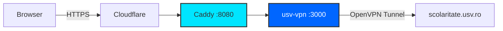

# USV Portal 🎓

<p align="left">
  <a href="LICENSE">
    
  </a>
  
  
  
  
</p>

> Portal neoficial pentru accesarea platformei `scolaritate.usv.ro` din orice browser modern, fără VPN local.

**Dezvoltat de:** [Vichiriuc Adrian](https://github.com/28VYK) (@28VYK)  

**[→ noteusv.tech](https://noteusv.tech)** — live, gratuit, doar pentru studenții USV.

---

## ⚠️ Disclaimer

**Acest proiect nu este afiliat oficial cu Universitatea „Ștefan cel Mare" Suceava.**
Este o soluție independentă (Proof of Concept) creată de un student, utilizată pe propria răspundere.

Platforma funcționează ca **reverse proxy** — cererile (inclusiv credențialele) trec temporar prin serverul nostru, exclusiv în memorie, fără stocare persistentă.
Codul este complet open-source.

→ [Politică de Confidențialitate](./docs/PRIVACY.md) · [Politică de Securitate](./docs/SECURITY.md) · [Ghid de Contribuție](./docs/CONTRIBUTING.md) · [Credite & Autori](./docs/CREDITS.md)

---

## 🔴 Problema

`scolaritate.usv.ro` folosește TLS 1.0 — blocat de toate browserele moderne:

```
Chrome  → ERR_SSL_VERSION_OR_CIPHER_MISMATCH
Firefox → SSL_ERROR_NO_CYPHER_OVERLAP
```

USV Portal rezolvă asta intermediind conexiunea pe server (via VPN intern USV), expunând o interfață modernă și accesibilă.

---

## 🚀 Rulare locală

```bash
git clone https://github.com/28VYK/USV-PROXY.git
cd USV-PROXY

# Configurează .env cu credentialele VPN (vezi .env.example)
# Adaugă fișierul usv2.ovpn în vpn/

docker compose up --build -d
```

> **Notă:** Certificatele SSL (`certs/`) și fișierele private (`vpn/`, `.env`) nu sunt incluse în repository.

---

## 🏗️ Arhitectură



| Serviciu | Rol | Tehnologie |
|----------|-----|------------|
| **Caddy** | Reverse proxy cu TLS (Cloudflare Origin CA) | `caddy:2-alpine` |
| **Next.js 14** | Frontend + API Routes (proxy logic) — rulează ca user non-root | `Next.js` |
| **usv-vpn** (sidecar) | Container izolat: OpenVPN + NET_ADMIN + /dev/net/tun | `openvpn` |

---

## 🛠️ Stack

- **Next.js 14** — framework + API routes ``
- **Caddy 2** — TLS termination ``
- **Docker + OpenVPN** — containerizare & VPN `` ``

---

## 🤝 Contribuie la proiect

Proiectul este 100% open-source și dezvoltat din pasiune în timpul liber. Orice ajutor este binevenit! 
Dacă vrei să contribui cu cod, să raportezi un bug sau să îmbunătățești documentația, te rugăm să citești mai întâi **[Ghidul de Contribuție](./docs/CONTRIBUTING.md)** pentru detalii legate de rularea locală cu Docker și stilul de cod.

---

## ☕ Susține proiectul

Serverul VPS are costuri lunare. Dacă platforma îți este utilă:

**[→ Donează pe Revolut](https://revolut.me/28vik/pocket/dOomdzRh2c)**

---

## ⚖️ Licență & Credite

Acest proiect este distribuit în mod deschis sub licența **MIT**. Întregul cod sursă și designul platformei sunt dezvoltate de **Vichiriuc Adrian (28VYK)**.

Vezi fișierele [LICENSE](LICENSE) și [docs/CREDITS.md](./docs/CREDITS.md) pentru textul juridic complet și lista detaliată a creditelor de dezvoltare.
