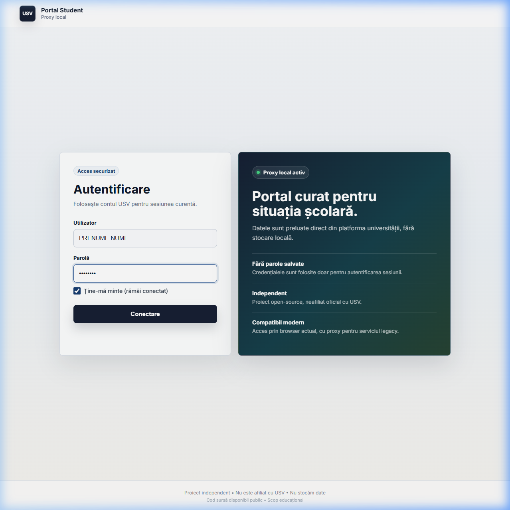
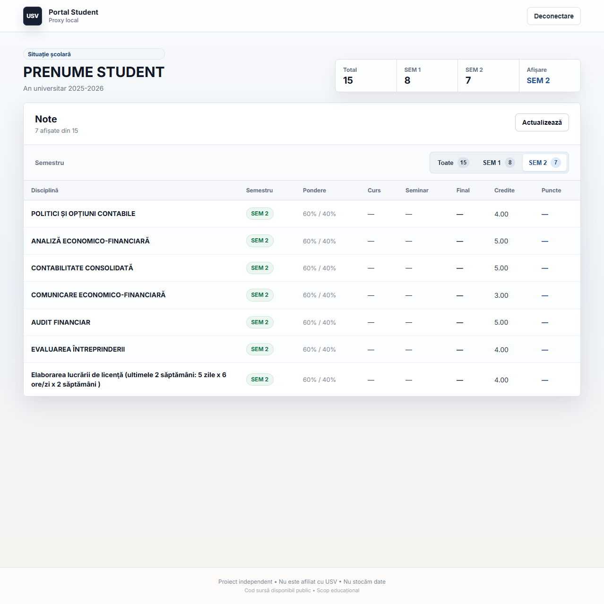

# USV Scolaritate - Reverse Proxy

Soluție pentru accesarea platformei `scolaritate.usv.ro` din browsere moderne.

## 🔴 Problema

Platforma PeopleSoft folosește protocoale TLS învechite (TLS 1.0) care sunt blocate de browserele moderne din motive de securitate:

- Chrome: `ERR_SSL_VERSION_OR_CIPHER_MISMATCH`
- Firefox: `SSL_ERROR_NO_CYPHER_OVERLAP`
- Edge: conexiune refuzată

## ✅ Soluția

Un reverse proxy care:

- Acceptă conexiuni **TLS moderne** de la browsere
- Comunică cu serverul PeopleSoft folosind **TLS legacy**
- **NOU:** Oferă funcționalitate **"Ține-mă minte"** (sesiune persistentă) cu auto-login în fundal, eliminând nevoia de a reintroduce datele la fiecare vizită.

## 🖼️ Screenshot-uri

> **Notă:** Capturile de ecran de mai jos reflectă funcționalitățile recente: opțiunea de auto-login și vizualizarea notelor.




## 🚀 Instalare (pentru dezvoltare locală)

### Cerințe

- Node.js 18+
- npm
- VPN USV conectat

### Pași

```bash
# Clonează repository-ul
git clone https://github.com/YOUR_USERNAME/usv-proxy.git
cd usv-proxy

# Instalează dependențele
npm install

# Pornește serverul de dezvoltare
npm run dev
```

Accesează `http://localhost:3000` cu VPN-ul USV activ.

## 📁 Structura Proiectului

```
usv-proxy/
├── pages/
│   ├── index.js              # Frontend - pagina de login și note
│   └── api/
│       ├── login.js          # Proxy pentru autentificare PeopleSoft
│       ├── proxy.js          # Proxy pentru navigare în portal
│       └── asset/[...path].js # Proxy pentru resurse statice
├── next.config.js            # Configurare Next.js
└── package.json
```

## 🔐 Securitate

- **NU stochează parole sau date pe server** - Datele sunt transmise direct către/de la serverul USV.
- Dacă se folosește funcția **"Ține-mă minte"**, credențialele sunt stocate exclusiv **local, în browser-ul utilizatorului** (via `localStorage`), niciodată pe server.
- **NU stochează** date personale sau note.
- Codul este open-source și poate fi auditat.

## 🏢 Propunere pentru Implementare Instituțională

Pentru ca platforma să funcționeze direct din `scolaritate.usv.ro` cu orice browser modern, recomandăm configurarea unui reverse proxy Nginx în infrastructura universității:

### Configurare Nginx Minimală

```nginx
server {
    listen 443 ssl http2;
    server_name scolaritate.usv.ro;

    # Certificate SSL moderne
    ssl_protocols TLSv1.2 TLSv1.3;
    ssl_certificate /etc/ssl/certs/usv.crt;
    ssl_certificate_key /etc/ssl/private/usv.key;
    ssl_ciphers ECDHE-ECDSA-AES128-GCM-SHA256:ECDHE-RSA-AES128-GCM-SHA256;

    location / {
        # Proxy către serverul PeopleSoft intern
        proxy_pass https://peoplesoft-intern.usv.ro;

        # Permite TLS legacy pentru PeopleSoft
        proxy_ssl_protocols TLSv1 TLSv1.1 TLSv1.2;
        proxy_ssl_ciphers ALL;
        proxy_ssl_verify off;

        # Headers
        proxy_set_header Host $host;
        proxy_set_header X-Real-IP $remote_addr;
        proxy_set_header X-Forwarded-For $proxy_add_x_forwarded_for;
        proxy_set_header X-Forwarded-Proto $scheme;
    }
}
```

### Avantaje ale implementării instituționale:

- ✅ Zero modificări necesare pentru studenți
- ✅ Funcționează cu orice browser modern
- ✅ Nu necesită browsere vechi sau configurații speciale
- ✅ VPN-ul rămâne obligatoriu pentru acces
- ✅ Serverul PeopleSoft nu necesită modificări

## 🛠️ Tehnologii Folosite

- [Next.js](https://nextjs.org/) - Framework React
- [Node.js](https://nodejs.org/) - Runtime
- HTTPS Agent personalizat pentru TLS legacy

## 📝 Licență

MIT License - Proiect open-source în scop educațional.

## 👤 Autor

Proiect dezvoltat de un student USV pentru a facilita accesul la note.

---

**Notă:** Acest proiect nu este afiliat oficial cu Universitatea Ștefan cel Mare Suceava.
